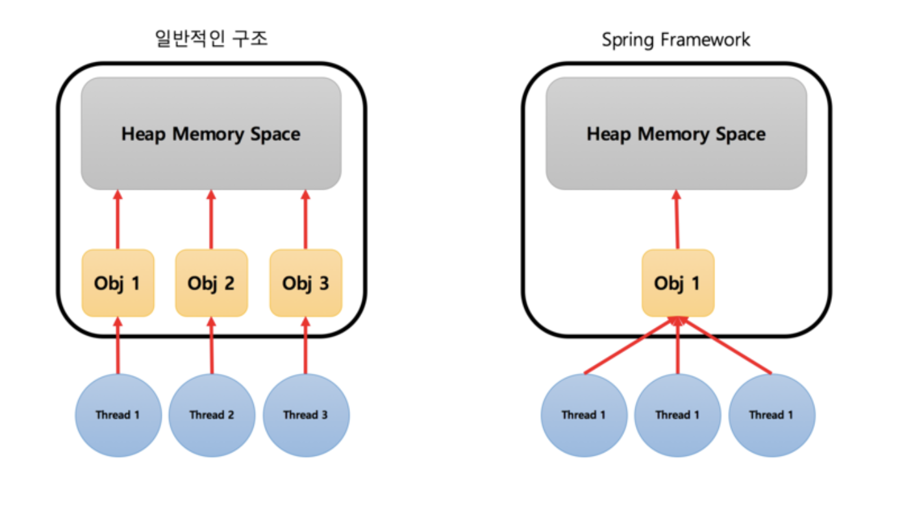
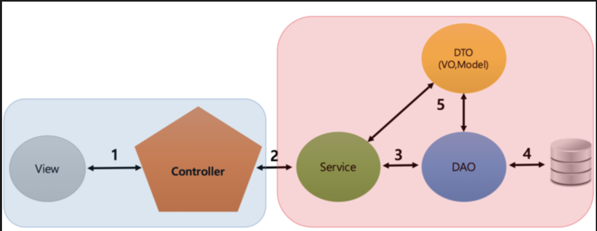

## DB없이 회원가입 및 목록 기능 구현

> 공부한 내용

**template engine**

- html = 정적 <-> tepmplate engine = 동적

**Mustache**

> Ex)

```html
Hello {{name}} You have just won {{value}} dollars! {{#in_ca}} Well, {{taxed_value}} dollars, after
taxes. {{/in_ca}}
```

```java
{
  "name": "Chris",
  "value": 10000,
  "taxed_value": 10000 - (10000 * 0.4),
  "in_ca": true
}
```

- `{{변수명}}`
- `{{#조건}}` ~ `{{/조건}}` or `{{#객체}}` ~ `{{/객체}}`
- `{{{html}}}` -> html 를 string으로 출력

- `{{^배열}}` ~ `{{/배열}}`
- `{{#배열}}` ~ `{{/배열}}`-> for 문
- …mustache 공식문서 <http://mustache.github.io/mustache.5.html>

**Model**

- `ModelAttribute(" ")` => view 로 문자열을 전달해줌

**html 중복 제거**

- base.html

```html
{{#block "header"}}
<h1>Title</h1>
{{/block}} {{#block "content"}} {{/block}} {{#block "footer" }}
<span>Powered by Handlebars.java</span>
{{/block}}
```

- Content.html

```html
{{#partial "content" }}
<p>Home page</p>
들어갈 내용~!~!~~ {{/partial}} {{> base}}
```

**WebMvcConfigurer**

```java
@Configuration
public class MvcConfig implements WebMvcConfigurer {

  @Override
  public void addViewControllers(ViewControllerRegistry registry) {
    registry.setOrder(Ordered.HIGHEST_PRECEDENCE);

    registry.addViewController("/user/form").setViewName("user/form");
    registry.addViewController("/user/login").setViewName("user/login");
    registry.addViewController("/").setViewName("main/index");
  }
}
```

- url 를 함수로 일일히 구현 x 자동으로 연결시켜줌
- templates에있는 이름.html 실행

**Service** [참고 자료](https://onlyformylittlefox.tistory.com/13?category=556988)



|            |                            |
| ---------- | -------------------------- |
| Controller | Request를 **어떻게** 처리  |
| Service    | Request를 어떤 처리        |
| Dao        | Data access object         |
| VO         | 자바 객체 (Getter, Setter) |

Client — Request —> Controller —> Service

Service —> Controller —> client

- service
  - Interface 만들어서 class 구현

> 궁금 궁금

**Spring Framework 구조**



singletone을 권장하는 이유

- 일반적인 구조는 스레드 수만큼 객체 생성 but 스프링은 xml에 bean으로 미리 정의해 놓고 각 스레드가 자원을 공유 하면서 실행.

왜 Dao, Service에서 Interface를 사용하는가?

- 유지보수가 편한 코드를 작성하도록 유도
- 굳이 안 써도 된다는 의견이 많음 : 안써도 잘돌아감, 프로젝트에 따라 다름...[토의 내용](https://blog.fupfin.com/?p=81)

> 리뷰

- 종근이형

  - [x] 다형성에 대해 알아보고 다시 반영해봤으면 좋겠습니다.
    - 다형성 : 상속을 통해 기능을 확장하거나 변경 하는 것을 가능하게 해주고, 같은 클래스 내에 코드의 길이를 줄여줌.
    - 깜박함...
  - [x] users를 전역변수로 선언한 특별한 이유가 있을까요?
    - 전역변수(?) 멤버변수 아닌가요? 멤버변수로 선언한 이유는 1. 자바지기가 시켜서 2. db가 없기 때문에 userController에 모두 접근 할 수 있는 곳
  - [x] `@RequestMapping`에 대해 알아보고 중복을 줄여보세요
    - `@RequestMapping(/url)` -> /url + ...
  - [x] service 레이어에 대해 알아보고 controller에서 비즈니스 로직을 분리해보세요
    - controller, service, Dao, vo 로 분리해보겠습니다
